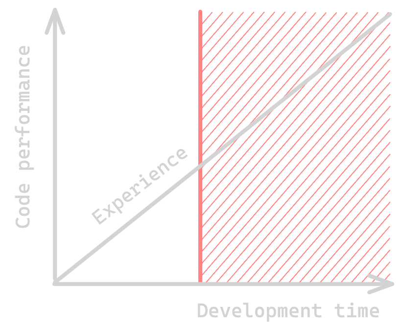

This article goes contre courant. The point is not to say
In fact, I wrote this article in VS code, and github copilot kept suggesting exactly the kind of banalities I am willing to fight in this article.

Leave technical debt of code optimization for another article.

"Premature optimization is the root of all evil" - Donald Knuth

Problems
- When should I care about performance? What is "premature optimization"?
- 

What is performance? CPU? Latency? Memory usage? 
Performance is 
Big O notation space & time complexity

Context
What is the frequency ?

 <!-- begin columns block -->
# Example 1
Lorem markdownum insigne...

<---> <!-- magic separator, between columns -->

# Example 2
Lorem markdownum insigne...



Code optimization, trade-off and entropy

Overengineering




```csharp
public void Hello()
{
    
}
```