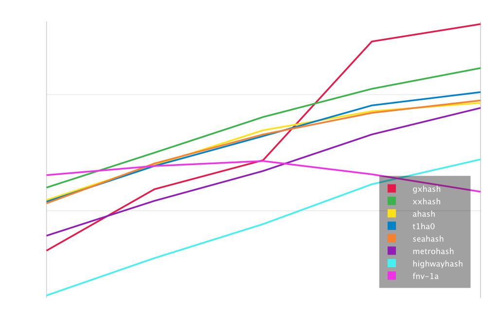

While developing GxHash over my spare time during my last parent leave (babies sleep a lot, I swear I'm a good father 😇), I went down the rabbit hole and came up with increasingly low-level optimizations. In this article, I want to talk about one of the nastiest ones, but to whom GxHash is owed to be the fastest non-cryptographic hashing algorithm up to this date. 

I called this optimization 🥁🥁🥁 "**Unsafe Read Beyond of Death**" (or URBD).

To achieve maximum performance, one of the design goals of GxHash was to use SIMD instructions as much as possible. SIMD instructions are a set of instructions that allow a single instruction to operate on multiple data elements in parallel. In practice, with a single SIMD instruction operating on 16 or even 32 bytes of data at once, input data would be required to be a multiple of 16 or 32 bytes, but in practice, inputs are of arbitrary lengths. Other highly-optimized hashing algorithms that rely on SIMD usually process the uneven part with scalar instructions, which is slower and implies special handling (thus more instructions).

For GxHash, I decided to avoid such scalar operations and load this uneven part into a 16 bytes zero-padded SIMD register. A simple and safe way to do this is to copy the uneven part into a zero-initialized temporary buffer, and then load this buffer into a SIMD register.

```rust
#[cfg(target_arch = "x86_64")]
use core::arch::x86_64::*;

pub type State = __m128i;

#[inline(always)]
pub unsafe fn get_partial_safe(data: *const State, len: usize) -> State {
    // Temporary buffer filled with zeros
    let mut buffer = [0i8; VECTOR_SIZE];
    // Copy data into the buffer
    std::ptr::copy(data as *const i8, buffer.as_mut_ptr(), len);
    // Load the buffer into a __m256i vector
    return _mm_loadu_si128(buffer.as_ptr() as *const State);
}
```

This worked well and simplified the code a lot by allowing a generalization of the hashing logic to only operate on 16 bytes chunks. However, this approach has a performance cost: the copy operation. While GxHash still outperformed other hashing algorithms for large payloads, the copy operation was a huge bottleneck for small payloads. A reason for this is that the algorithm was very CPU cache friendly while this single copy operation was reading from RAM, which is orders of magnitude slower.



# Read beyond madness

To avoid this copy operation, I decided to experiment with reading beyond the end of the input buffer. This is a very dangerous operation, as you don't know what's beyond the end of the buffer. The OS may throw a SIGSEGV at your face and terminate your process. Let's try it anyway...

```rust
#[cfg(target_arch = "x86_64")]
use core::arch::x86_64::*;

pub type State = __m128i;

#[inline(always)]
pub unsafe fn get_partial_unsafe(data: *const State, len: usize) -> State {
    return _mm_loadu_si128(data); // ☠️
}
```

Using this instead of copying, we have a more than x10 speedup for small payloads. Of course, we're far from done as this code will hash bytes that don't belong to our stream and also eventually crash the program. But we might have something.

# Sanitizing

## "Safe" read beyond

A trick to avoid reading beyond the end of the buffer is to make sure the end of the buffer lies on the same page. Typically, the OS will allocate memory in pages of 4KB, thus we can make a function that checks whether it is okay to read beyond or if we should fallback to the copy version.

```rust
#[inline(always)]
unsafe fn check_same_page(ptr: *const State) -> bool {
    let address = ptr as usize;
    // Mask to keep only the last 12 bits
    let offset_within_page = address & (PAGE_SIZE - 1);
    // Check if the 16nd byte from the current offset exceeds the page boundary
    offset_within_page < PAGE_SIZE - VECTOR_SIZE
}
```

Considering a page size of 4096 bytes, the likelihood of having 32 bytes on the same page exceeds 99%. This safety check is cost-effective, retaining most performance benefits while ensuring safety.

## SIMD Masking

We can now read beyond safely, but we still need to mask the bytes that don't belong to our stream. Again, we want to use SIMD instruction to do this, or it'll defeat the purpose of the optimization. A trick is to create a constant vector of consecutive bytes and compare it to the length of the stream. That would return us a mask that we can apply to the vector.

```rust
#[inline(always)]
pub unsafe fn get_partial_unsafe(data: *const State, len: usize) -> State {
    let indices = _mm_set_epi8(15, 14, 13, 12, 11, 10, 9, 8, 7, 6, 5, 4, 3, 2, 1, 0);
    // Create a mask by comparing the indices to the length
    let mask = _mm_cmpgt_epi8(_mm_set1_epi8(len as i8), indices);
    // Mask the bytes that don't belong to our stream
    return _mm_and_si128(_mm_loadu_si128(data), mask);
}
```

## Mixing length back into the equation

We're not done yet. As we read N bytes into a 16 bytes vector, we kind of lost the context of the length of that uneven part.

For instance, let's say our input data is a blob of 7 bytes, like so:

```
  1  2  3  4  5  6  7  8  9  10 11 12 13 14 15 16
0x01 42 08 7A 89 10 00 ?? ?? ?? ?? ?? ?? ?? ?? ??
```

We read this into a 16 bytes vector, and we mask the bytes that don't belong to our stream:

```
  1  2  3  4  5  6  7  8  9  10 11 12 13 14 15 16
0x01 42 08 7A 89 10 00 00 00 00 00 00 00 00 00 00
```

But what if the input is now a blob of 6 bytes?
```
  1  2  3  4  5  6  7  8  9  10 11 12 13 14 15 16
0x01 42 08 7A 89 10 ?? ?? ?? ?? ?? ?? ?? ?? ?? ??
```

We would read this into a 16 bytes vector, and we mask the bytes that don't belong to our stream:

```
  1  2  3  4  5  6  7  8  9  10 11 12 13 14 15 16
0x01 42 08 7A 89 10 00 00 00 00 00 00 00 00 00 00
```

The result is the same as the previous one, while the input was different (this one had one more 0x00). This is a problem, as we want to make sure that the length of the input is taken into account. 

A trick is to wrap-add the length of the uneven part to every byte of the masked vector. This way, the masked bytes will be different for different lengths of the input.

## Read the uneven part first

A complementary trick to this optimization is to read the uneven part first, and then read the 16 bytes chunks. For inputs greater than 16 bytes, it means we can assume it's safe to read beyond the end of the buffer since there will be more bytes to read after. This enables us to skip the safety check in this specific scenario.

# Putting it all together

Here is the final code for the URBD optimization:

```rust
#[cfg(target_arch = "x86_64")]
use core::arch::x86_64::*;

pub type State = __m128i;

#[inline(always)]
pub unsafe fn get_partial(p: *const State, len: usize) -> State {
    // Safety check
    if check_same_page(p) {
        get_partial_unsafe(p, len)
    } else {
        get_partial_safe(p, len)
    }
}

#[inline(always)]
unsafe fn check_same_page(ptr: *const State) -> bool {
    let address = ptr as usize;
    // Mask to keep only the last 12 bits
    let offset_within_page = address & (PAGE_SIZE - 1);
    // Check if the 16nd byte from the current offset exceeds the page boundary
    offset_within_page < PAGE_SIZE - VECTOR_SIZE
}

// Fast path
#[inline(always)]
pub unsafe fn get_partial_unsafe(data: *const State, len: usize) -> State {
    let indices = _mm_set_epi8(15, 14, 13, 12, 11, 10, 9, 8, 7, 6, 5, 4, 3, 2, 1, 0);
    // Create a mask by comparing the indices to the length
    let mask = _mm_cmpgt_epi8(_mm_set1_epi8(len as i8), indices);
    // Mask the bytes that don't belong to our stream
    let partial_vector = _mm_and_si128(_mm_loadu_si128(data), mask);
    // Wrap-add the length of the uneven part to every byte of the masked vector
    _mm_add_epi8(partial_vector, _mm_set1_epi8(len as i8))
}

// Fallback
#[inline(always)]
pub unsafe fn get_partial_safe(data: *const State, len: usize) -> State {
    // Temporary buffer filled with zeros
    let mut buffer = [0i8; VECTOR_SIZE];
    // Copy data into the buffer
    std::ptr::copy(data as *const i8, buffer.as_mut_ptr(), len);
    // Load the buffer into a __m256i vector
    let partial_vector = _mm_loadu_si128(buffer.as_ptr() as *const State);
    _mm_add_epi8(partial_vector, _mm_set1_epi8(len as i8))
}
```

# Some results!

Here is the same benchmark including the URBD optimization. The chart is log-scaled in both X and Y. You can see that GxHash is now the fastest non-cryptographic hashing algorithm even for small payloads, and by quite a margin.


The numbers:

| Throughput (MiB/s) | 4 | 8 | 16 | 32 | 64 |
|---|---|---|---|---|---|
| gxhash | 6292.82 | 12605.37 | 25252.22 | 29296.83 | 40690.10 |
| xxhash | 1594.03 | 3166.81 | 6465.02 | 11452.38 | 16961.84 |
| ahash | 1247.40 | 2482.24 | 4972.79 | 7312.82 | 8663.48 |
| t1ha0 | 1221.45 | 2442.69 | 4457.48 | 8174.15 | 10766.91 |
| seahash | 1160.73 | 2547.56 | 4480.69 | 7054.78 | 9047.05 |
| metrohash | 612.20 | 1223.72 | 2225.81 | 4445.55 | 7768.96 |
| highwayhash | 189.08 | 390.12 | 768.08 | 1692.98 | 2780.67 |
| fnv-1a | 2042.93 | 2455.40 | 2715.25 | 2083.61 | 1462.05 |

Source code for the algorithm and benchmarks can be found on the [GxHash repository](https://github.com/ogxd/gxhash)!