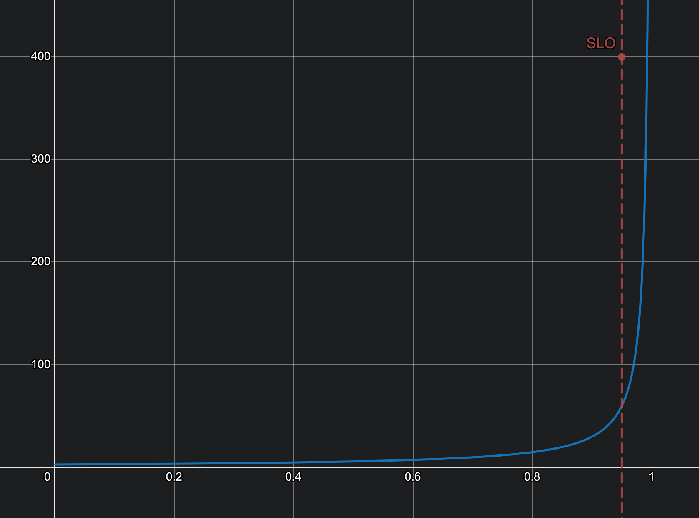

WORK IN PROGRESS

https://dzone.com/articles/managing-tail-latency

During my time at [Equativ](https://equativ.com/), I had the opportunity to work on a distributed system serving hundreds of billions of requests per day, while maintaining high availability and low latency. To meet this last goal, we were using Service Level Objectives (SLOs) to define the expected response time of our services using the 95th percentile of the latency distribution.

In a distributed architecture involving many different services and technologies, latency can be a complex and unpredictable beast, and we had to challenge our assumptions and practices to meet our SLOs more than once. In this article, I would like to take a step back and try to come up with a theoretical and comprehensive approach to managing latency in distributed systems, more specifically on the usage of timeouts.

# Modeling latency percentiles

#e2e1df

## Sequentialism

# Timeouts / retries / fallbacks

Exceptions

Logs pollution

Appropriate value?

Pessimistic timeout