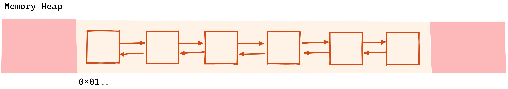

In this article I'd like to share my journey learning about caching, and my research on how to make it more efficient. This article is the first in a series of articles on caching, and here we'll start by discussing the challenges and memory considerations when doing in-memory caching.

This was done as part of my day job as a Staff backend engineer at Equativ, a leading provider of digital advertising solutions, offering a range of products and services to help businesses reach their target audiences and achieve their marketing goals. 

At Equativ, we solve scalability issues with distributed service-oriented architecture, but that comes at the cost of increased network I/Os which can impact performance and latency negatively. In this context, caching is critical.

Caching helps reduce the load on various services of the ad service pipeline since they'll be requested less often and perform fewer computations, which can improve the system's overall performance.

Caching can also help to reduce the latency, or delay, in the ad delivery process since less I/Os implies less latency in the process of delivering the ad to the user. This not only improves the user experience but makes ad-serving more competitive in a real-time bidding context and means fewer in-flight requests at any given moment on the infrastructure (less pressure).

Unfortunately, caching is a complex computer science subject and many papers were published with various algorithms to try to maximize the caching efficiency in a wide variety of contexts. Before getting into any particular implementation details, we'll delve in this article into what would make a given implementation better suited than another. 

# Reducing cache misses

As the purpose of a cache is to store commonly requested data to be able to serve it faster and reduce computation time or network IOs, the main objective for a cache component is to be able to have the requested data stored as often as it can.    
In an ideal world, the cardinality of requests (the total number of unique requests) is finite, but in a wide number of applications, it is infinite or just too high for the cache to store every response to every possible request in memory.    
Given this memory constraint, the challenge is to find the best caching strategy to keep the number of cache misses to a minimum (we call a cache request a miss whenever the entry was to store in the cache, meaning that the cache did not help). We can also measure the cache efficiency the other way around by measuring the number of cache hits (when the cache already has the value for the requested key stored in memory, meaning that no additional I/Os or computation has to be performed for that operation).    
This "caching strategy" is defined by what we call admission/eviction policies. Hundreds of policies exist nowadays, and this is still as of today a hot research topic. 

## Cache access patterns

As caching is a common practice across all digital systems, there is a wide variety of applications (CPU caches, search engine results, web page contents, ...). This implies that choosing the "best" caching policies will highly depend on the current context. For this reason, it is crucial to be able to classify cache access patterns.

### Locality of references

It turns out that a lot of research has already been conducted in this field. The term [locality [of reference](https://en.wikipedia.org/wiki/Locality_of_reference) was introduced by Peter J. Denning in 2005 in the paper "The Locality Principle" and is now commonly used in computer science. This Wikipedia article is rather well written and the principle itself is quite general (it's not just about caching) so we won't get into too much detail here, but we can denote a few common cache access patterns from this.

### Common access patterns

This is not an exhaustive listing of all patterns, but rather a possible classification:
- **Recency-friendly access patterns** When an entry is likely to be accessed multiple times, in a row or almost (in other words, there is a strong locality of reference). In this scenario, a simple cache eviction policy such as LRU (Least Recently Used) works well. We'll dive into actual policies in a future article in this series.
- **Thrashing access patterns** When the access pattern is cyclic (repeats over time)
- **Scan/streaming access patterns** When there is little to no locality of reference. It's the opposite of the recency-friendly access pattern.
- **Mixed access patterns** When the pattern is a mix of the above. In this scenario, it is often best to benchmark policies as it can become difficult to classify further.

### Scan resistance

Given the common access patterns we've seen, there is a criterion called **scan resistance** which is the ability of a cache policy to handle scan patterns without discarding all actual common entries. This is important for mixed access patterns, where a sudden burst of streaming accesses (little to no locality of reference for a duration) can fill up a cache with one-hit entries while discarding the ones that were likely to be requested later. It is important to choose a cache eviction policy that is scan-resistant when there is some scan/streaming access pattern going on. For instance, the LRU policy (which is the most commonly used policy in general because of how simple the implementation is) is not scan-resistant at all and can become inefficient as the streaming access pattern is prominent.

## Keys cardinality

While looking for the best-suited caching policies is important to increase the caching efficiency, a complementary technique is to lower the cardinality of the key fields.    

Let's say we're implementing a caching mechanism for a search engine. Unless you're building the next Google, it's likely that the order of the keywords is not important, thus, why would we consider "John Doe" to be a different request than "Doe John"? By considering the two queries the same we end up improving the caching efficiency by a lot. In this example, this could be achieved for instance with a simple sort over the list of keywords.    

Here is a non-exhaustive list of ideas to reduce the cardinality of cache keys:
- If keys are composed of several inputs (such as words in our example above), does the order matter? If not, then sort them so that keys with the same inputs are always presented the same way to the cache.
- If keys or one of its inputs is a string, does the case matter? If not, transform them to lowercase every time to reduce cardinality. In the same spirit, you can trim whitespaces or EOL characters.
- Avoid raw floating values. Floating values are known to be quite "volatile". Usually, rounding them to a precision that makes sense can prevent this issue.

Depending on the criticality, it is sometimes worth monitoring this cardinality in some ways. That can be done in several ways. For instance, if the keys are made of several distinct inputs, the uniqueness of each input can be computed independently. Lowering the cardinality of the most volatile input may decrease the overall cardinality of the keys.    

Finally, an interesting approach is to AB test different ways to build the keys and measure the impact of each over the efficiency. This can be a bit tricky to set up but that's to my knowledge the easiest and the most efficient way to move forward when keys are complex and the access pattern is mixed.

## Eviction policy

Have you ever heard or seen this quote: "There are only two hard things in Computer Science: cache invalidation and naming things"? Either this is a joke or the hard truth, I think the idea behind this is that the hardest things in computer science are non "solvable" problems. Cache invalidation, like naming things, is difficult because there is no universal solution. It's a matter of context, tradeoffs and even sometimes personal taste.    

A cache invalidation policy (or cache eviction policy) is the logic for invalidating an entry from the cache. Eviction policies can serve multiple purposes, such as invalidating an entry after a given time (for instance an absolute or sliding [TTL - Time To Live](https://en.wikipedia.org/wiki/Time_to_live)).    
When a cache takes too much memory, an eviction policy is required to discard entries whenever the maximum memory allowed (or the maximum number of entries) is reached. Such policies can also be called [cache replacement policies](https://en.wikipedia.org/wiki/Cache_replacement_policies). 
Some commonly used eviction policies for limiting memory usage are LRU (Least Recently Used) or LFU (Least Frequently Used) for instance, however as stated above, this is a complex and broad computer science topic. In this article, we're focused on in-memory caching for microservices and still, in this context, there are plenty of options: every year new scientific papers are published with new ideas and some policies can even be combined (for instance TTL+LRU).

## Admission policy

An admission policy can be used to prevent entries from being stored in the cache given some criteria. For instance, in some applications, you may know in advance that a given entry is unlikely to hit the cache more than once (for a search engine it could be a very long query). Then you may decide to never store such entries (and so no replacement policy would come into play). My advice is to use an admission policy whenever it can apply. If what occupies the most cache memory is the value (compared to keys), then an interesting trick is to still store the keys in the cache when the admission policy prevents the storage of the value. This would have a slight memory overhead because we would store more keys, however, it allows us to keep track of the usage of a given key, making it possible for the admission policy to predict more accurately whether a value is worth storing or not.

## Which caching policy is the best?

The answer is "it depends". The ideal policy would be the one that can predict the future to know in advance what is worth storing... But that's most of the time not possible, so in the end, there is no policy which outperforms others every time. You'll need to analyze access patterns and run benchmarks, and that takes time. However, when you get comfortable with common access patterns](### Common access patterns), you have a rough idea of what kind of policy you want to go for.    
In a future article in this caching series, we'll run benchmarks over a few common and less common cache replacement policies given various access patterns, hopefully, that will give you some insights as well.

# Reducing memory usage

We've seen how understanding the context to choose appropriate policies and bringing cardinality down is key to improving the likelihood of a cache being efficient. However, we intentionally left an important and complementary factor to cache efficiency, which is memory usage. As soon as a cache is constrained to store a limited number of entries or bytes, we know that pushing this limit or optimizing memory usage will increase global efficiency in most scenarios. Adding RAM or storage is a solution but we'll focus on the less obvious solutions (yet more cost-effective and more interesting for the sake of this article).

## Keys as hashes

The goal of a cache is to, from a given key, return an associated value without involving the I/Os or computations normally required, and for that, the cache itself does not need to understand what the key is made of. For this reason, if the key is made of a substantial amount of data, we can have the cache internally store a shortened (but still as uniquely identifiable) version of that key instead of the full key. That's how some high-performance key-value storages do this, such as [Aerospike](https://docs.aerospike.com/apidocs/csharp/html/f_aerospike_client_policy_sendkey) for instance.    

As it can become a bit cumbersome to deal with hashes on top of the caching middleware, in most languages supporting generics an interesting approach is to internalize this to the cache object. Here is what it would look like in C#:
```csharp
/// A cache that would store key
public interface Cache<Key, Value> {
    bool TryGetValue(Key key, Func<Key, Value> valueFactory, out Value value); 
}

/// A cache that store hashed keys, thus being more memory efficiency when keys are large objects
public interface Cache<Key, Hash, Value> {
    bool TryGetValue(Key key, Func<Key, Hash> hashFactory, Func<Key, Value> valueFactory, out Value value); 
}
```
This optimization can become quite powerful depending on the nature of the keys. Let's say we're caching search engine queries: on average, a key might be composed of 20 UTF-16 characters, representing 320 bits of data. Transforming this key to a 128-bit hash digest will divide by more than 2 the memory required for the keys part, thus making room for storing more entries and improving cache efficiency.   
Another benefit of such an approach is that keys of variable size are usually either individually stored on the heap or require an oversized buffer. With hashes of a fixed size, memory can be much more compact, which will reduce the CPU workload for several reasons.    
At Equativ, we have implemented a structure called `Hash128` to generate hashes from keys of any kind. It turns out [Unity (the 3D engine) has also recently implemented a similar API](https://docs.unity.cn/2022.1/Documentation/ScriptReference/Hash128.html) (with the same name!). Part of their implementation can be found [here on Github](https://github.com/Unity-Technologies/UnityCsReference/blob/master/Runtime/Export/Hashing/Hash128.bindings.cs). It can serve as a nice basis to understand how they do it but I wouldn't recommend copying any of this for licensing reasons obviously but also because I find it flawed in some ways (mutable structs = ⚠️). If you are interested in our implementation, don't hesitate to ask us in the comments and we'll try to make a dedicated article on it, we think it can have many usages and is worth sharing 😄.

### A word on collisions

According to the pigeonhole principle, given that input data is usually more than 128bit (otherwise there is no point in doing this optimization technique), collisions-free is not guaranteed. However, in practice, the likelihood hood to have a single collision is very low (about 1% chance of collision for 2,600,000,000,000,000,000 generated hashes with a good hashing algorithm). At Equativ, we haven't noticed a single collision, however, I wouldn't recommend this optimization if a single collision can have critical consequences.

## Value duplicates

In some cases, a cache can store several times the same value for different keys. As this percentage of duplicated values and the average value size increases, storing values once and storing references/pointers can make a big difference in memory usage, as we can see with [this interactive visualization](https://www.desmos.com/calculator/v4bb2k47xl). As for storing keys, this optimization does not always make sense, so once again it is important to understand the context to avoid doing additional lookups and storing additional pointers for no reason.

# Reducing memory fragmentation

Here I decided to talk about memory fragmentation as part of a whole different section. As we've seen storing hashed keys might not only help reduce memory usage but might also help reduce memory fragmentation depending on what the keys are. Memory fragmentation is a crucial performance indicator yet often overlooked given how difficult it can be to measure/observe it, as opposed to memory usage.

## Arena-based linked list

Most cache eviction policies (actually, all that I can think of) require the usage of one or more doubly linked lists to achieve true O(1) operations since such data structures allow O(1) removals and O(1) insertions while keeping order. Unfortunately, in Rust, Dotnet, Python, Java and probably many other languages, base libraries include a doubly linked list implementation where a node is an object individually allocated on the heap. This will inevitably imply a lot of allocations/deallocations and memory fragmentation.    

    

There is however a possible alternative, which we call arena-based linked lists. In short, as opposed to allocating nodes individually on the heap, we allocate one continuous buffer. The base principle came to us when we looked at how dotnet base `Dictionary<K, V>` class handles new entries with fields keeping track of free slots. For our linked list implementation, when the buffer is allocated, even if there is room for 1000 nodes but only 10 are actually used, we keep behind the scenes 990 "free" nodes linked together. Then, when a new entry is added to the list, we simply have to pick the first free entry at O(1) cost without having to allocate anything (unless the buffer is too small and needs to be resized). This is kind of having a linked list within our linked list for tracking free nodes. Thanks to this, we are now able to implement eviction policies with minimal allocations, less fragmentation, and better CPU affinity.    

    

In case you are interested or just curious, [here is an open-sourced version of that linked list implementation](https://github.com/ogxd/optimized-linked-list).    
You can see how the CPU times and allocations compare with the one from the Dotnet BCL:    
```
|            Method |       Mean |     Error |    StdDev |  Gen 0 |  Gen 1 |  Gen 2 | Allocated |
|------------------ |-----------:|----------:|----------:|-------:|-------:|-------:|----------:|
|       AddFirstBCL | 102.818 ns | 2.0356 ns | 3.5651 ns | 0.0080 | 0.0029 | 0.0004 |      48 B |
| AddFirstOptimized |   6.527 ns | 0.1034 ns | 0.0808 ns |      - |      - |      - |         - |
|        AddLastBCL | 101.499 ns | 1.2358 ns | 1.1560 ns | 0.0080 | 0.0029 | 0.0004 |      48 B |
|  AddLastOptimized |   6.476 ns | 0.1129 ns | 0.1056 ns |      - |      - |      - |         - |
```

# What's next?

We went through the most important factors to take into account when setting up a cache. With this, we should be able to analyze a given use case by asking ourselves a few questions:
- Is it part of a critical path?
- How much memory space is available?
- What's the access frequency?
- How can we qualify the access pattern?

From that, we can make an informed choice in picking a cache eviction policy implementation that is well-suited. In the next article, we'll see what exists in the literature, break down implementation details to better understand their strength and weaknesses, how to combine them, and finally compare them in some real-world scenarios.