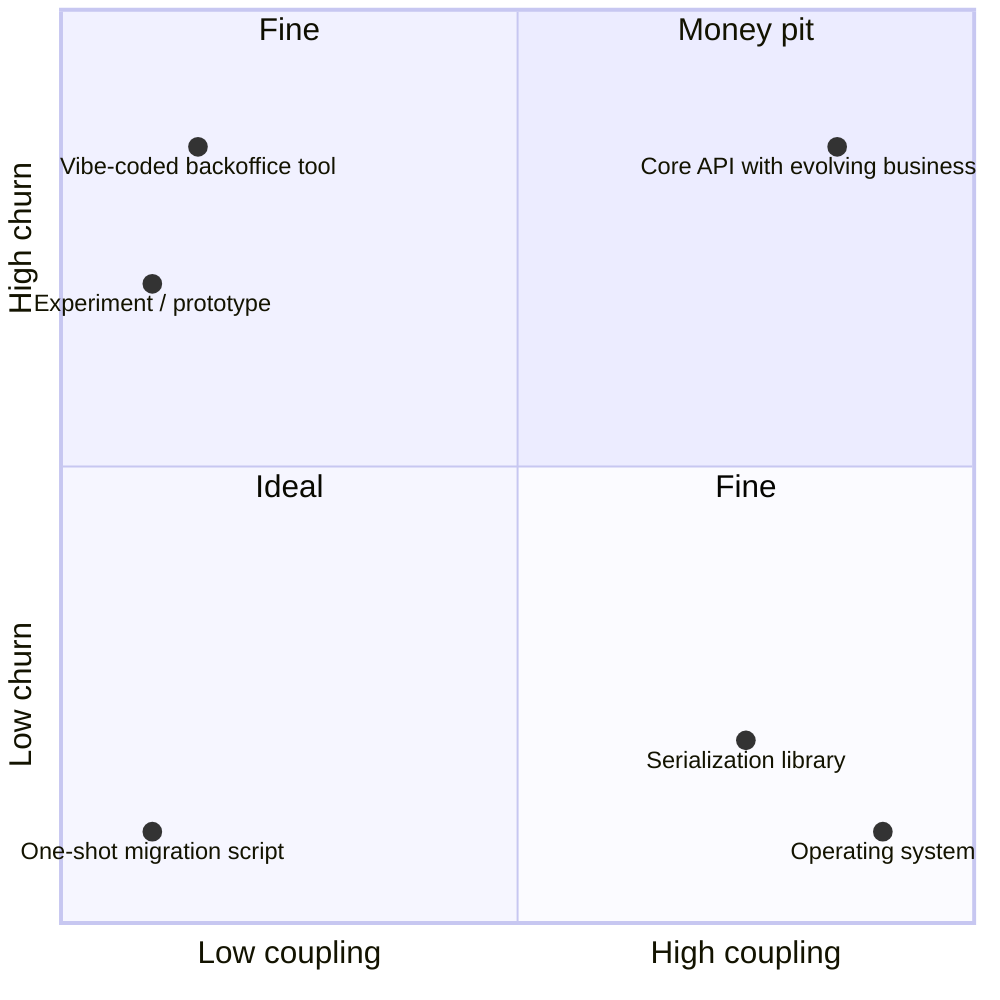

What matters most in a company is where the focus is. In engineering, it is very easy to spend hours building solutions to problems that don't exist, and then spend the following years maintaining them, fixing them, and untangling the coupling layers they've grown with other components.

Every company wastes resources this way. But companies without clear objectives, and without the courage to say "no", will waste *the majority* of their resources this way, without ever noticing. Sometimes it ultimately kills the product, and occasionally the company itself.

Software is particularly exposed to this because there is virtually no hardware cost to development: nothing physical stops you from building the wrong thing. And with AI agentic coding, producing code has never been cheaper, so it's never been easier to flood a codebase with solutions nobody asked for. The bottleneck was never *writing* the code anyway.

So how do we know, before building something, how much it will really cost us?

# The intuition trap

Intuitively, we estimate the cost of a solution as proportional to its size: the effort it takes to build, and in software, the amount of code it requires. Big feature, big cost. Small script, small cost. This intuition is wrong, and it's worth understanding why, because it leads to bad decisions on both ends:

- We greenlight small solutions that end up bleeding us dry for years.
- We fear large solutions that would actually cost us close to nothing after the initial effort.

The size of a solution is the cost of *building* it. But building is a one-time event, and as we just said, it's cheaper than ever. The real cost is the *ownership* cost: everything the solution will demand from your team after it's delivered. And that cost is driven by two factors that have little to do with size.

# A meta-heuristic: churn and coupling

I propose estimating the ownership cost of a solution with two simple dimensions.

## Churn

Churn is how often the solution will change, and by how much. Business rules that evolve every sprint, a UI that follows the product roadmap, an integration with a partner that keeps changing their API: all high churn.

Churn is expensive because every change is much more than a diff:

- **Cognitive overhead**: someone has to page the solution back into their head, every time.
- **Context switching**: back and forth between this solution and whatever the team was actually focused on.
- **Documentation**: every change invalidates a bit of the docs, diagrams, and runbooks.
- **Coordination**: discussions, reviews, RFCs, release notes, migration announcements...

## Coupling

Coupling is how tied the solution is to other solutions. It comes in several flavors:

- **API surface**: does it expose an API? How wide is it? How public is it? An internal endpoint used by one consumer is not the same as a public API with external customers building on it.
- **Package dependency**: is it a library others depend on? How deep in the dependency tree does it sit? A leaf utility is cheap, while a core package that fifty services transitively pull in is not.
- **Shared state**: does it read or write data that other components rely on (a database schema, a message contract, a cache)?

Coupling is expensive because it turns *your* changes into *everyone's* problem. Every modification must preserve compatibility, or trigger a migration, or break someone. The more coupled a solution is, the more each change costs. And in return, changes in the coupled components will cost *you*.

## The formula

Here is the heuristic:

$$
cost \propto churn \times coupling
$$

Note that it's a multiplication, not an addition. A solution that changes constantly but that nothing depends on is cheap. A solution that everything depends on but that never changes is cheap too. What is ruinous is the combination of the two: every frequent change rippling through every coupling point.

Also note what's absent from the formula: the size of the solution, and its complexity.

# The four quadrants

Low churn and low coupling is the ideal, of course. But it's not always achievable: some solutions exist precisely to be depended upon, or precisely to follow a moving business. The good news is that you don't need to be in this quadrant. Either of the two "fine" quadrants is perfectly sustainable.

## High churn, low coupling: fine

Take a completely local, vibe-coded backoffice tool. Lots of code, possibly ugly, changing every week as internal users ask for tweaks. By the intuitive "cost ∝ code" metric, this thing is a disaster. In practice? It costs almost nothing. It's local, nothing depends on it, there is no API contract to honor and no consumers to migrate. If a change breaks it, you fix it or even regenerate it. Churn is high, but it's multiplied by a coupling of nearly zero.

Prototypes and experiments live here too, as long as they *stay* decoupled. That's the trap with this quadrant: the cheap experimental tool that quietly gains consumers has just moved to the money pit.

## Low churn, high coupling: fine

Now the mirror case: an operating system. It's one of the largest, most complex pieces of software your team touches (millions of lines, and more coupling than anything else in your stack, since literally everything runs on top of it). Yet engineering teams don't spend countless hours on the OS. They just use it, and it works. Same for the compiler, the standard library, a battle-tested serialization library, or that stable internal package nobody has touched in two years. Massive coupling, near-zero churn, near-zero cost.

This is the definitive proof that codebase size and complexity are not the cost. If cost were proportional to code, the OS would dominate every team's maintenance budget. It doesn't even appear on it.

## High churn, high coupling: the money pit

This is where resources go to die: the solution that changes every sprint *and* that everything depends on. Every business change forces an API discussion, an RFC, a versioning debate, consumer migrations, and a round of broken builds. Teams in this quadrant feel busy (and they *are* busy), but most of that effort is friction, not progress.

The worst part is that solutions rarely start here. They drift here, one "small" integration and one "quick" feature at a time. Which is why the heuristic matters *before* you build.

# Using the heuristic

Before committing to a solution, ask two questions:

- **How often will this change?** Is it tied to a moving business, an evolving product, an unstable partner? Or is the problem well-defined and done once solved?
- **What will depend on it?** Who consumes it, through which surface, and how hard would it be to change or kill later?

If both answers come back high, that's the moment to push back: narrow the API, make it internal, buy instead of build, or simply say "no". Saying no to a high-churn high-coupling solution is one of the highest-leverage engineering decisions a company can make, precisely because the cost it avoids is invisible on any roadmap.

And if you must build it anyway (sometimes the business genuinely demands it), at least attack one of the two factors. You often can't reduce churn since it comes from the outside world. But coupling is a design decision: keep the surface as small and as private as possible, isolate the volatile parts behind stable interfaces, and resist every request to expose "just one more endpoint".

Finally, you can flip the heuristic around for your own comfort: stop feeling guilty about big blobs of decoupled code, and stop fearing large stable dependencies. Ship the 5,000-line internal tool without a design committee. Depend on the huge library that never changes. The code you should lose sleep over is the hundred-line contract that changes every week and that half the company depends on.
