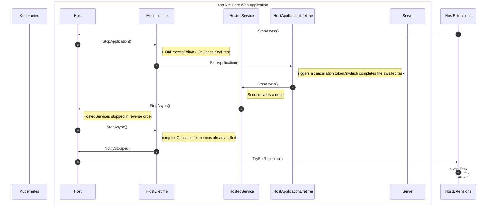

```mermaid
sequenceDiagram
    autonumber
    participant Kubernetes
    box Asp Net Core Web Application
    participant Host
    participant IHostLifetime
    participant IHostedService
    participant IHostApplicationLifetime
    participant IServer
    end

    HostExtensions->>Host: StopAsync()
    Host->>IHostLifetime: StopApplication()
    note right of IHostLifetime: ⚡ OnProcessExit/\n⚡ OnCancelKeyPress
    IHostLifetime->>IHostApplicationLifetime: StopApplication()
    note right of IHostApplicationLifetime: Triggers a cancellation token,\nwhich completes the awaited task
    IHostApplicationLifetime->>IHostedService: StopAsync()
    note right of IHostedService: Second call is a noop
    IHostedService->>Host: StopAsync()
    note right of Host: IHostedServices stopped in reverse order
    Host->>IHostLifetime: StopAsync()
    note right of IHostLifetime: noop for ConsoleLifetime,\nas already called
    IHostLifetime->>Host: NotifyStopped()
    Host->>HostExtensions: TrySetResult(null)
    HostExtensions-->>HostExtensions: await Task

```

# Solution 1: Using IHostApplicationLifetime

# Solution 2: Using