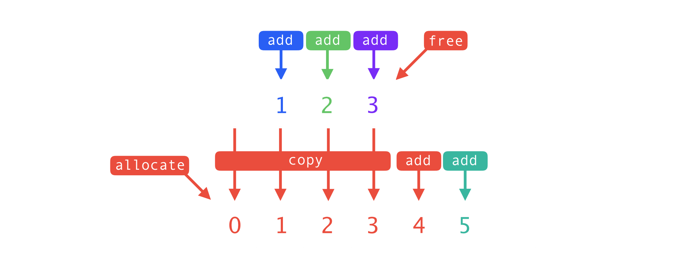

Dynamic collections, such as the dynamic array (also known as a `List` in C#), are without a doubt one of the most common data structure, and not only in C# but in computer science in general. 

The dotnet base class library exposes plenty of dynamic collections to fulfil a wide number of usecases: (`System.Collections.`)`List<T>`, `Dictionary<K, V>`, `HashSet<T>`, `Queue<T>`, `Stack<T>`, and more. But they all share one thing in common: they are based on dynamic reallocation of backing arrays, which can lead to suboptimal performance and excessive memory allocation.

Let's see how we can optimize this.

# What are dynamic collections?

A dynamically resizing collection works with one or more backing arrays. Let's take the `List<T>` as an example. By default, when a `List<T>` is created, it starts with a backing array of a size of 0 (or simply put no backing array). As the first element is added, a new array is allocated with a size of 4. When the fifth element is added, a new array is allocated with a size of 8, and elements from the old array are copied to the new one. This process is repeated every time the backing array is full, and the process repeats as we keep adding elements.



Here in this example we can see in red that the operation of adding the fifth element results in the creation of a new array with a larger capacity (8), the copy of the previous elements, the addition of the new element and finally the freeing of the old array (left to the garbage collector when in C#).

As you might have guessed, this reallocation follows a $log_{2}$ rule, with the capacity doubling every time the backing array is full. This is a good compromise to minimize the number of reallocations.

We can define the number of elements allocated by such model as:
$$
g(x)=4(2^{\operatorname{floor}(\log_{2}(x))}-1)
$$

Let's say we fill a list with 100 integers. The memory allocated can be calculated as follows:

$$
g(100)=4\times(2^{\operatorname{floor}(\log_{2}(100))}-1)
=4\times(2^6-1)
= 4\times(64-1)
= 4\times63
= 252
$$

As you can see we're allocating 2.5 times more memory than we actually need.

We can divide $g(x)$ by $x$ to get the average number of bytes allocated per element. [See the result in this Desmos visualization](https://www.desmos.com/calculator/e9hnuwgxsn).

You can see that we are roughly allocating between 2 and 4 times the memory we actually need, independently of the number of elements.

## A small benchmark

Let's benchmark this. Here we'll be using BenchmarkDotNet and .NET 8. The benchmark is ran on an M1 Macbook Pro.

Here we compare the performance of a `List<int>` with and without (exact) capacity preallocation.

```csharp
[Benchmark]
public List<int> Reference() // WithCapacity()
{
    List<int> listWithoutCapacity = new(); // new(EntriesCounty);
    for (int i = 0; i < EntriesCount; i++)
    {
        listWithoutCapacity.Add(i);
    }
    return listWithoutCapacity;
}
```

Here are the results:

| Method       | EntriesCount | Mean          | Error         | StdDev        | Allocated |
|------------- |------------- |--------------:|--------------:|--------------:|----------:|
| Reference    | 50           |     110.82 ns |      1.334 ns |      1.248 ns |     648 B |
| WithCapacity | 50           |      51.84 ns |      1.061 ns |      1.179 ns |     256 B |
| Reference    | 5000         |   5,917.24 ns |     61.912 ns |     51.699 ns |   65840 B |
| WithCapacity | 5000         |   4,060.86 ns |     59.039 ns |     65.622 ns |   20056 B |
| Reference    | 500000       | 888,194.09 ns | 17,660.545 ns | 33,170.784 ns | 4195192 B |
| WithCapacity | 500000       | 471,742.47 ns |  5,221.942 ns |  4,629.116 ns | 2000272 B |

As you can see, the collection with preallocated capacity uses less CPU times and allocates less memory. 

# How to improve the performance?

## Set `capacity` to known size in the collection's constructor

In dotnet, the optimal solution is to preallocate such collections using the `capacity` argument available in constructors for most of theses collections. However, it's not always possible to know the exact number of elements that will be added to the collection.  

Other solutions have their own drawbacks, and share in common the fact that it will complexify the code and make it harder to maintain, so at this point we may want to profile prior to embarking on such optimizations.

## Set `capacity` to maximum known size

Sometimes, we may know the maximum size of the collection. In such case, it can be beneficial to preallocate the collection with the maximum size.  

One example is when we extract or filter elements out of an existing collection:

```csharp
List<int> input = ...
// The output may contain *at most* input.Count elements
// Thus we can preallocate the output list with a capacity of input.Count
List<int> output = new List<int>(input.Count);
foreach (var i in list)
    if (ShouldKeep(i))
        output.Add(i);
```

It's a bit more tricky when using Linq expression as the `ToList()` method does not take a capacity argument (that's unfortunate!), still, it's possible:

```csharp
List<int> input = ...
List<int> output = new List<int>(input.Count);
output.AddRange(input.Where(ShouldKeep));
```

This optimization, when doable, has the benefit of not complexifying the code too much, however it may result in oversized backing arrays depending on the context.

## Iterate twice

An underrated technique is to iterate twice: once to count the number of elements (then we can set the exact capacity), and once to add the elements. This technique is particularly useful when the cost of iterating twice is cheap compared to the cost of reallocation. Plus, the capacity is now set to the exact size of the collection.

```csharp
List<int> input = ...

// Iterate once to count the number of elements
int count = 0;
foreach (var i in input)
    if (ShouldKeep(i))
        count++;

// Preallocate the output list with the exact capacity
List<int> output = new List<int>(count);

// Iterate a second time to add the elements
foreach (var i in input)
    if (ShouldKeep(i))
        output.Add(i);
```

As you can see, here we are bloating the code a bit. Plus, the performance gain is very context-dependent.

## Hardcoded heuristics

In some situations, the average size of a collection in a piece of code can be estimated, either from the context or from metrics. Let's say you need to list all metro stations a Parisian would pass by in a day. It would likely be somewhere between 1 and 20, but never 1000. So we could hardcode a capacity of let's say 15 and consider it better than no capacity at all.

A drawback is that it may bring your coworkers to ask you why you chose 15 and not 20, or 10, or 5. It's also difficult to maintain, as the context may change over time. So you'd likely add comments to explain your choice, and start doubting your own choice when you read back your code a few months later... meh.

## Predictive sizing heuristics

Here is the last technique, and the reason as of why I chose to write this article. This technique is about tracking the final sizes of collections to compute a sizing that can then be used to preallocate future instances of same collections.

### Retrieving the final size of a collection

The trickiest part is to track final sizes of the collections. In order to know the final size of let's say a `List<int>`, we need to know when it's done being used. By chance, the garbage collector just does that in it's first phase (a.k.a. the Mark phase) when it finds unreachable objects. We can leverage the finalizer (a.k.a. destructor) of an object to know when it's done being used.  

Most dotnet generic collections aren't sealed, thus we could inherit from them and implement such finalizer. However, this has several drawbacks:
- We find inheriting from collections to not be very elegent, and possibly confusing for other developers. Plus we'd have to repeat this for every collection type we want to track.
- It would mean that a finalizer would be invoked for every collection that is garbage collected, which is not very efficient. We could use `GC.SuppressFinalize` to achieve some kind of sampling, only keeping finalizers for a fraction of the collections, but it really feels like duct tape plumbing.
- What about sealed collections?

An interesting alternative is to use an `ConditionalWeakTable` to associate an object dedicated to tracking the final size of a collection (let's call this class `Finalizer`) to the collection itself. Here is a comment from the `ConditionalWeakTable` source code:

```csharp
// Lifetimes of keys and values:
// Inserting a key and value into the dictonary will not
// prevent the key from dying, even if the key is strongly reachable
// from the value. Once the key dies, the dictionary automatically removes
// the key/value entry.
```

In our context, that means that the value (`Finalizer`) can reference the key (the collection) without preventing the collection from being garbage collected. This is exactly what we need. When the collection is garbage collected, the `Finalizer` object will be garbage collected as well, invoking it's finalizer method, which accesses the collection size to update the predictive sizing.

We this solution, we can chose to only track a fraction of the collections (reducing the overhead of the finalizers). Plus, this solution is generic and can be applied to any collection type.

```csharp
public class MyListFactory
{
    private readonly ConditionalWeakTable<List<T>, Finalizer> _weakTable;
    private int _recommendedCapacity;

    private List<T> CreateList<T>()
    {
        List<T> list = new(_recommendedCapacity);
        if (ShouldTrack(list))
            _weakTable.Add(list, new Finalizer(list, this));
        return list;
    }

    private void Update(int count)
    {
        _recommendedCapacity = ...
    }

    class Finalizer(List<T> list, MyListFactory<T> factory)
    {
        ~Finalizer()
        {
            factory.Update(list.Count);
        }
    }
}
```

### Computing the optimal size

From the final sizes, we now need to compute the optimal size. There aren't a single approach to this, but we chose to use the average multiplied by some factor, and clamped to a maximum value. In our implementation we made the factor and maximum configurable, but we chose 1.3 and 65536 as default values (1.3 seemed like a good compromise in our tests, and when the collection stores bytes, 65536 is highest power-of-two that remains below the LOH threshold of 85K bytes).

As a this development purpose is only optimization, we'd also make this the computation of the heuristic is optimized as well. In this context, we avoid any kind of loop for computing any kind of statistics, and only rely on "running" methods. A way to compute a running average is to store a limited numbers of sizes in a doubly linked list and store the sum of the sizes. When a new size is added, we remove the oldest size from the sum, add the new size, and update the list. This way we can compute the average in constant time. We then make this "window" configurable. The wider the window, the more accurate the average, but the more memory it consumes and the slower it is to update if new patterns emerge.

Another concern is thread safety: computing averages and other statistics in a thread-safe manner can be very complex, however we're fortunate that the finalizers are invoked in a single thread (called [the finalizer thread](https://github.com/dotnet/runtime/blob/5a54b6dbe8dca1751f6b2d1bb53a88c19fe941ee/src/coreclr/vm/finalizerthread.cpp)) -at least that's how it is as of .NET 10-. Thus we'll simple protect ouserlves for a potential future change with a lock, and do our computations without caring much about thread-safety.

### Handling uneven distributions

Until now, we've assumed that the distribution of sizes is roughly even. However, in some cases, the distribution can be very uneven. In such cases, the predictive sizing will have a limited effect. Let's say for instance that the size of a collection is either 0 or 10000: the average will be 5000, and the predictive sizing will be 6500 (assuming a factor of 1.3). This is not enough to prevent reallocation (at 8192 elements the backing array will be reallocated to 16384), and it also wastes memory when the size is 0.  

While we are not sure how to keep the optimization effective in this situation, we can at least detect such case to fallback to not using any capacity at all. This way, the optimization can be used without risk of making things worse.  

An approach to detect uneven distribution is to compute the [Margin of Error (MOE)](https://en.wikipedia.org/wiki/Margin_of_error) and normalize it to an [0; 1] range so that we can compare it to a configurable threshold. The MOE is computed as the standard deviation divided by the average. A high MOE means that the distribution is uneven. We can then use a threshold to decide if we should use the predictive sizing or not.

The MOE is defined by $MOE=\frac{\sigma}{\sqrt{n}}$, where $\sigma$ is the standard deviation and $n$ is the number of samples. The MOE can be normalized to a [0; 1] range by dividing it by the average. That gives us:

$$
MOE_{normalized}=\frac{MOE}{\mu}
=\frac{\frac{\sigma}{\sqrt{n}}}{\mu}
=\frac{\frac{\sigma}{\sqrt{n}}}{\frac{sum}{n}}
=\frac{\sigma\sqrt{n}}{sum}
$$

The closer to 0, the more even the distribution is, and the closer to 1, the more uneven it is. We can then compare this value to a threshold, and, if above, use 0 as the predictive size.

### Computing a running standard deviation

Since our distribution estimator is based on the standard deviation, we need to find a way to compute it in a running manner, as we did for the average. Usually, the standard deviation formula is defined as: $\sigma=\sqrt{\frac{\sum_{i=1}^{n}(x_i-\mu)^2}{n}}$, where $\mu$ is the average. 

Translating this formula to code as-is means we'd need to iterate over all sizes to evaluate the sum of the squares of the differences. We need another approach to compute this in a running manner.

We can expand the square and split the sums:

$$
\sum_{i=1}^{n} (x_i - \mu)^2
=\sum_{i=1}^{n} (x_i^2 - 2x_i\mu + \mu^2)
=\sum_{i=1}^{n} x_i^2 - 2\mu\sum_{i=1}^{n} x_i + n\mu^2
=\sum_{i=1}^{n} x_i^2 - 2n\mu^2 + n\mu^2
=\sum_{i=1}^{n} x_i^2 - n\mu^2
$$

Here we managed to take $\mu$ out of a sum, making it possible to compute $\sigma$ in a running manner. This is done the same way as for the average, with the difference that we store the *sum of squared sizes* (as opposed to the *sum of sizes*).

### Putting it all together

Here is the code computing the predictive sizing, taking into account all the above considerations:

```csharp
private readonly int _windowSize;
private readonly int _maxCapacity;
private readonly double _factor;
private readonly double _spreadThreshold;
private readonly OptimizedLinkedList<int> _measurements;

private int _sum;
private int _sumOfSquares;

// Triggered by the finalizer when a collection is garbage collected
private void Update(int count)
{
    // Thanks to the minIntervalMs parameter, we expect this method to not be called too often,
    // avoiding contention on the underlying lock.
    lock (_measurements)
    {
        // Compute sliding sum and sliding sum of squares without iterating thanks to the linked list.
        // This then allows efficient computation of mean and variance.
        _measurements.AddLast(count);
        _sum += count;
        _sumOfSquares += count * count;

        if (_measurements.Count >= _windowSize)
        {
            _measurements.RemoveFirst(out int removedValue);
            _sum -= removedValue;
            _sumOfSquares -= removedValue * removedValue;
        }

        double mean = 1d * _sum / _measurements.Count;

        // Alternnative formula for computing standard deviation in a running manner
        double stddev = Math.Sqrt((1d * _sumOfSquares / _measurements.Count) - (mean * mean));

        // Use the MOE / mean to quantify how uneven the distribution is.
        double spread = stddev * Math.Sqrt(_measurements.Count) / _sum;

        // If the spread is too high, we consider the heuristic unreliable and we set the capacity to 0.
        _recommendedCapacity = spread > _spreadThreshold ? 0 : Math.Min(_maxCapacity, (int)(_factor * mean));
    }
}
```

You you'll find a fully working implementation in this [gist](https://gist.github.com/ogxd/b22adad991fbb81b302cd7159c00c548#file-preallocatedcollectionsfactory-cs).

## Benchmarks

Let's run a new benchmark where we compare how the different techniques perform. Keep in mind techniques are meant to be used in different contexts, and as any benchmarks, the numbers are "artificial" and may not reflect the performance in your specific context. This serves as a hint on how the techniques compare in a specific context.

Here we benchmark time but most importantly memory allocation. We filter out 200000 elements out of a list of 550000 and return a list of the remaining 350000 elements. In such context:
- Reference is no capacity preallocation (`NoPreAllocate`)
- If the output size is known in advance, we may simply set the capacity to the output size (`PreAllocateExact`)
- If the input size is known in advance, we may employ the technique of setting the capacity to the exact size (`PreAllocateMax`)
- If the filtering is cheap, we may iterate twice and use exact capacity (`PreAllocateExactIterTwice`)
- If the distribution is even enough, we may use predictive sizing (`WithPredictiveSizing`)

| Method                    | Mean     | Error     | StdDev    | Allocated |
|-------------------------- |---------:|----------:|----------:|----------:|
| NoPreAllocate             | 1.554 ms | 0.0429 ms | 0.0629 ms |      4 MB |
| PreAllocateExact          | 1.289 ms | 0.0423 ms | 0.0593 ms |   1.34 MB |
| PreAllocateMax            | 1.244 ms | 0.0200 ms | 0.0267 ms |    2.1 MB |
| PreAllocateExactIterTwice | 2.066 ms | 0.0396 ms | 0.0554 ms |   1.34 MB |
| WithPredictiveSizing      | 1.230 ms | 0.0242 ms | 0.0323 ms |   1.74 MB |

Todo (WithPredictiveSizing 1.3 ratio alloc)

## Summary

Todo

| Context | Technique | Drawback(s) | Example |
|---|---|---|---|
| Size is known | Set `capacity` to known size in collection's constructor |  |  |
| Maximum size is known | Set `capacity` to maximum known size | - Might result in oversized backing arrays depending on the context | `test` |
| Iteration cost is cheap | Iterate twice | - Adds complexity<br/> - Cost of iterating twice |   |
| Average size at runtime is roughly known (eg from metrics) | Hardcoded heuristics | - Adds complexity<br/> - Difficult to maintain |   |
| None of the above | Predictive sizing | - Adds complexity<br/> - Limited effect when distribution is very uneven |   |