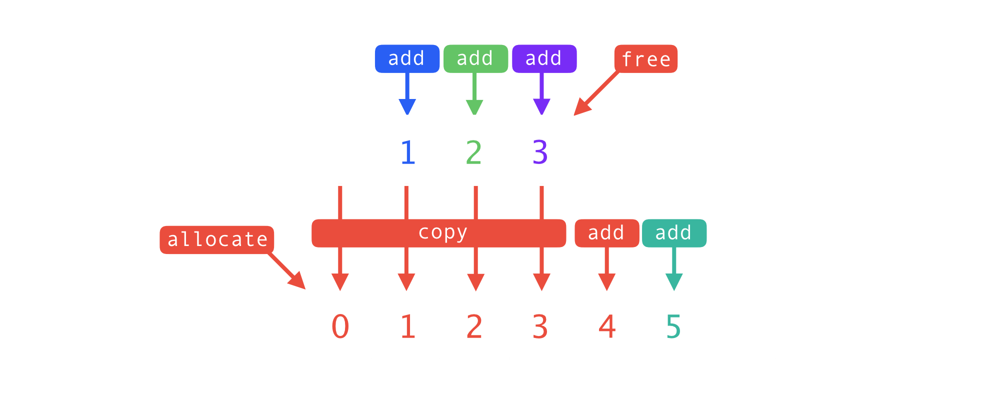
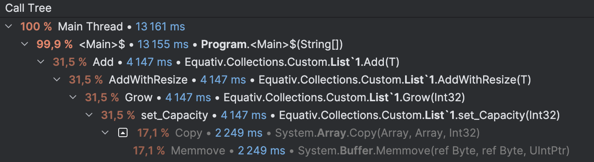

Dynamic collections, such as the dynamic array (also known as a `List` in C#), are without a doubt one of the most common data structure, and not only in C# but in computer science in general. 

The dotnet base class library exposes plenty of dynamic collections to fulfil a wide number of usecases: (`System.Collections.`)`List<T>`, `Dictionary<K, V>`, `HashSet<T>`, `Queue<T>`, `Stack<T>`, and more. But they all share one thing in common: they are based on dynamic reallocation of backing arrays, which can lead to suboptimal performance and excessive memory allocation.

Let's see how we can optimize this.

# What are dynamic collections?

A dynamically resizing collection works with one or more backing arrays. Let's take the `List<T>` as an example. By default, when a `List<T>` is created, it starts with a backing array of a size of 0 (or simply put no backing array). As the first element is added, a new array is allocated with a size of 4. When the fifth element is added, a new array is allocated with a size of 8, and elements from the old array are copied to the new one. This process is repeated every time the backing array is full, and the process repeats as we keep adding elements.



Here in this example we can see in red that the operation of adding the fifth element results in the creation of a new array with a larger capacity (8), the copy of the previous elements, the addition of the new element and finally the freeing of the old array (left to the garbage collector when in C#).

As you might have guessed, this reallocation follows a $log_{2}$ rule, with the capacity doubling every time the backing array is full. This is a good compromise to minimize the number of reallocations.

We can define the number of bytes allocated by such model as:
$$
g(x)=4\cdot(2^{\operatorname{floor}(\log_{2}(x))}-1)
$$

Let's say we fill a list with 100 integers: the memory allocated will be (not in bytes but in 'slots'):

$$
g(100)=4\cdot(2^{\operatorname{floor}(\log_{2}(100))}-1)\\\
g(100) = 4\cdot(2^6-1)\\\
g(100) = 4\cdot(64-1)\\\
g(100) = 4\cdot63\\\
g(100) = 252
$$

As you can see we're allocating 2.5 times more memory than we actually need.

We can divide $g(x)$ by $x$ to get the average number of bytes allocated per element. [See the result in this Desmos visualization](https://www.desmos.com/calculator/e9hnuwgxsn).

You can see that we are roughly allocating between 2 and 4 times the memory we actually need, independently of the number of elements.

## A small benchmark

Let's benchmark this. Here we'll be using BenchmarkDotNet and .NET 8. The benchmark is ran on on an M1 Macbook Pro.

Here we compare the performance of a `List<int>` with and without (exact) capacity preallocation.

```csharp
[Benchmark]
public List<int> Reference() // WithCapacity()
{
    List<int> listWithoutCapacity = new(); // new(EntriesCounty);
    for (int i = 0; i < EntriesCount; i++)
    {
        listWithoutCapacity.Add(i);
    }
    return listWithoutCapacity;
}
```

Here are the results:

```plaintext
| Method       | EntriesCount | Mean          | Error         | StdDev        | Allocated |
|------------- |------------- |--------------:|--------------:|--------------:|----------:|
| Reference    | 50           |     110.82 ns |      1.334 ns |      1.248 ns |     648 B |
| WithCapacity | 50           |      51.84 ns |      1.061 ns |      1.179 ns |     256 B |
| Reference    | 5000         |   5,917.24 ns |     61.912 ns |     51.699 ns |   65840 B |
| WithCapacity | 5000         |   4,060.86 ns |     59.039 ns |     65.622 ns |   20056 B |
| Reference    | 500000       | 888,194.09 ns | 17,660.545 ns | 33,170.784 ns | 4195192 B |
| WithCapacity | 500000       | 471,742.47 ns |  5,221.942 ns |  4,629.116 ns | 2000272 B |
```

As you can see, the collection with preallocated capacity is faster and allocates less memory. 

With some profiling it appears that the performance penalty from not preallocating is mostly due to the reallocation and copying of the backing array.



# How to improve the performance?


# Predictive sizing

## Tracking collection lifetime

## Handling uneven distributions

## Benchmarks