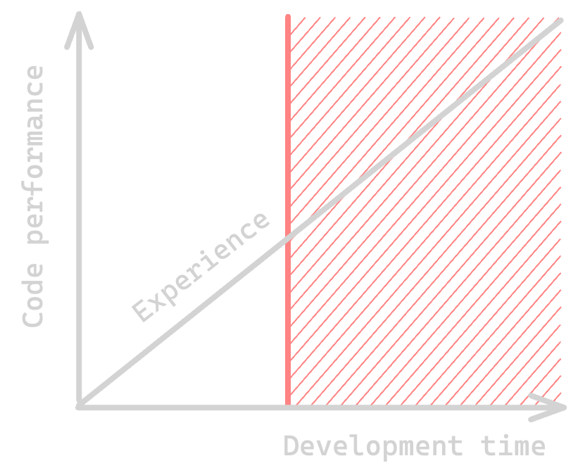

Many languages and frameworks have been designed to make developers more productive. This is a good thing, but it has a side effect: it makes developers less aware of the performance implications of their code.  

While hardware has been getting faster and faster over the years, the place software has taken in our lives has also been growing. In the end, the performance of the code we write is still important, and it's important to know when to care about it (and when not to).  

I won't revive traumas of the past and talk about big O time and space complexity, nor I will serve you a "premature optimization is the root of all evil" bullshit.  

The pressure of delivering performant code in a culture of productivity can be very frustrating, and so here I am going to give you an easy and pragmatic approach to knowing when to care about performance, and when not to, so you can all be productive and happy developers 😊.

# TL;DR; for lazy readers

When planning a development, think about how often (roughly) the resulting code will be invoked.
- **If the code isn't going to be invoked often**, then you don't necessarily need to care about performance. Keep it simple, and focus on readability, maintainability and testability. 
- **If the code is going to be invoked often**, then you should care about performance (the more often the more you should). Plan some extra time for benchmarking, optimization passes and profiling in the real world.

# Time is money

The performance of the code developers write is roughly proportional to the time they spend on it. Experience may modulate this relationship, but it's still a good rule of thumb.

Unless you're only programming for fun, it's more than likely that you are writing code for a few bucks, and most likely you're paid based on time. This means it is expected for you to be productive, thus limiting the time you can spend coding a given feature.

Given this limited time, the level of optimization of the code you're about to ship is going to be limited as well. This is why it's important to know when to care about performance, and when not to, and only then estimate the time you're going to spend on it.

# When to care about performance?

Here is the dreaded question. I'll spare you the "it depends" answer, as I think I have a very systemic and pragmatic approach to answering it.  

Just ask yourself those two questions:
- How often is the code going to be invoked?
- How likely is it to change in the future?

## Frequency

I think that's the most important question to ask. **The more often a piece of code is going to be invoked, the more you should care about its performance**. Sounds obvious, right?

You don't have to know exactly how often the code you're about to write is going to be invoked. You often can tell by the nature of the feature and system you're working on. For instance, a piece of code that is going to be invoked for every incoming request on a web service is likely to be invoked a lot, while a piece of code that is going to be invoked only once when the application starts is likely to be invoked less often.

Like [combinatorial explosion](https://en.wikipedia.org/wiki/Combinatorial_explosion), the invocation frequency for a piece of code can escalate quickly. For instance, a feature that checks X business rules for every incoming request on a web service that receives Y requests per second per instance, with Z instances, is going to be invoked about X * Y * Z times per second. With 1000 rules, 1000 rps and 1000 instances, that's 1 billion invocations per second.

At 1 billion invocations per second, a piece of code that only takes 1µs of CPU time is going to take 1,000s of CPU time per second or 1,000 full CPU cores. If we consider a power consumption of 10W per core, that's 10,000W or power consumption, or 87,600kWh per month. At $0.25 per kWh (current price in France), that's $21,900 per month 💸.  
Allocations-wise, a single memory allocation in this path is going to generate 1 million allocations per second per instance, which is likely to generate a lot of pressure on the garbage collector, thus increasing the latency of the service 🐌.  
Environmentally speaking, it's not too good either 😵.

Put in perspective, it might be interesting to spend a few days optimizing this piece of code.

On the other hand, if the code is called at startup, is intended for internal tooling, or is behind a heavily sampled path, then it's likely called not so frequently, and you should not spend too much time optimizing it and rather focus on readability, maintainability and testability.

## Volatility (a.k.a. "code churn")

Optimization does not necessarily mean increased complexity: often, simplicity is the key to performance. Still, we can't deny that once the simplicity card has been played, the next optimization levers can imply more complex data structures, exotic algorithms, or unsafe code to name a few. This can make a piece of code more complex to grasp, maintain and evolve.  

For this reason, it's important to consider the volatility of the code. **If the code is going to be modified often, then you should be more cautious about the trade-offs you make**.  

For instance, a new business feature is likely to receive a lot of changes, so you may want not to go too deep while optimizing. On the other hand, a change on the logging stack is less likely to change (given its company-internal nature and the fact that logging is a well-defined practice), thus is more appropriate to use more complex optimization techniques in this context. 

# So what then?

Well, if you've estimated that the code you're about to write isn't going to be invoked often, you're free to focus on using what you're the most comfortable with, and what is the most readable, maintainable and testable for your team. As your software evolves and your business grows, at some point, you might have to revisit the code you've written and optimize it, but unless you knew it in advance, you shall not feel guilty about it and can leave this to the future you or your successors. If you have doubts, you can always instrument your code to measure its performance/invocation frequency and come back to it later.

Otherwise, it depends on how often is going to be invoked and how likely this code is to evolve in the future. Benchmark, optimize, profile, and iterate. Ask your peers for help if you're stuck, ask for feedback when you think you've started pulling some unusual tricks, and test your code in the real world.  

And more importantly, don't forget to have fun! 😊 